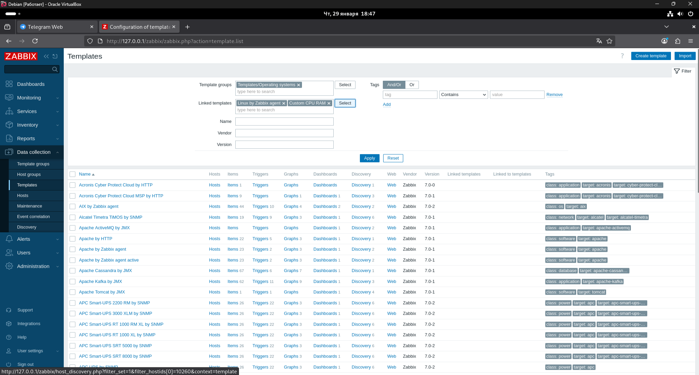
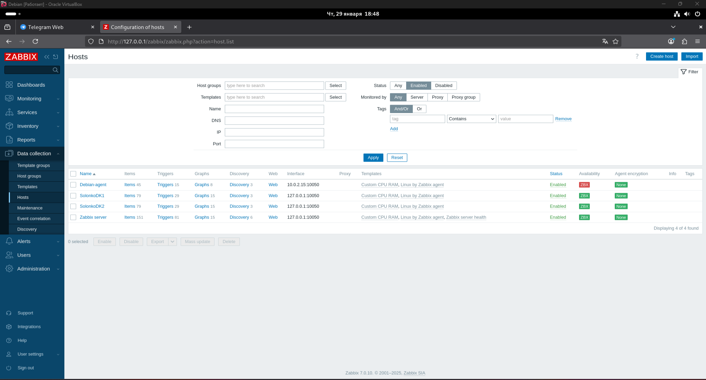
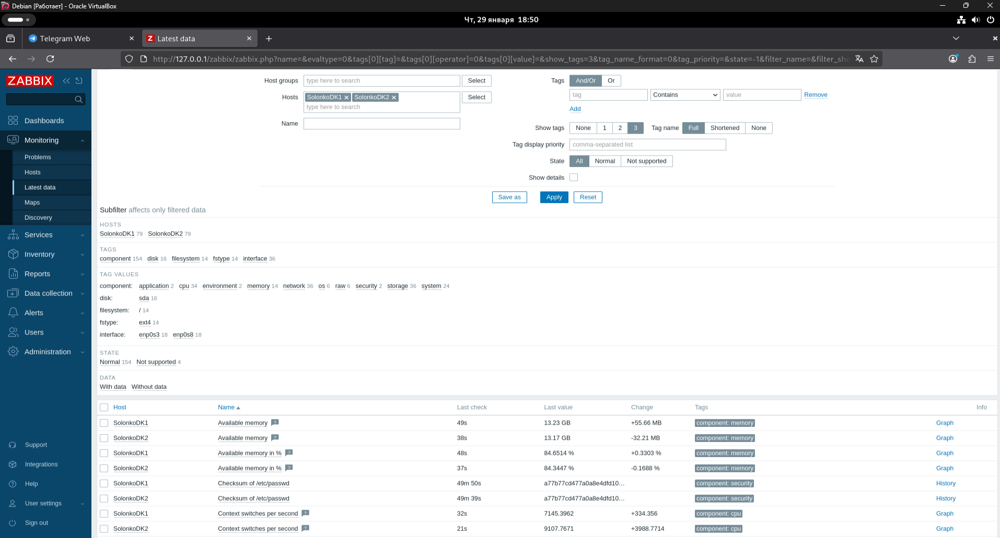
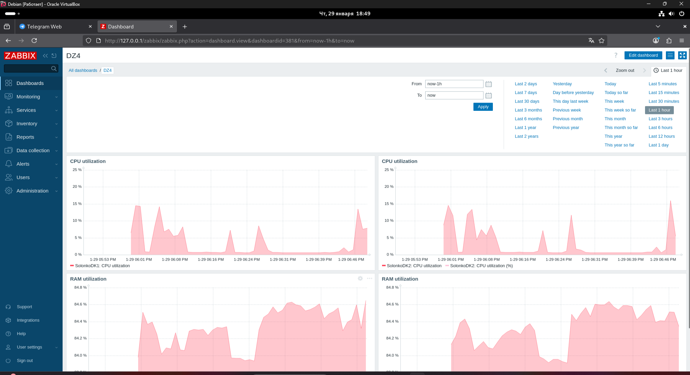

# Zabbix Monitoring — Практическая работа

Данная работа выполнена в рамках практического задания по Zabbix и включает:
- создание собственного шаблона мониторинга CPU и RAM;
- добавление и настройку хостов с Zabbix Agent;
- проверку поступления данных;
- создание кастомного дашборда.

---

## Задание 1. Создание пользовательского шаблона

### Цель
Создать собственный шаблон Zabbix, который собирает:
- загрузку CPU в процентах;
- загрузку RAM в процентах.

### Что сделано
- Создан шаблон **Custom CPU RAM**
- В шаблон добавлены элементы данных:
  - CPU utilization (%)
  - RAM utilization (%)
- Шаблон привязан к стандартному шаблону **Linux by Zabbix agent**

### Подтверждение выполнения
Скриншот страницы шаблонов Zabbix с созданным шаблоном:

---

## Задание 2. Добавление хостов и установка Zabbix Agent

### Цель
Добавить два хоста и настроить сбор данных через Zabbix Agent.

### Что сделано
- Добавлены два хоста:
  - `SolonkoDK1`
  - `SolonkoDK2`
- На обе виртуальные машины установлен **Zabbix Agent**
- В конфигурации агентов указан Zabbix Server
- Хосты успешно подключились к серверу (статус ZBX — зелёный)
- К каждому хосту привязаны шаблоны:
  - `Linux by Zabbix agent`
  - `Custom CPU RAM`

### Подтверждение выполнения
Скриншот страницы **Configuration → Hosts**:

---

## Задание 3. Проверка поступления данных (Latest Data)

### Цель
Убедиться, что данные с хостов успешно поступают в Zabbix.

### Что сделано
- Проверен раздел **Monitoring → Latest data**
- Отображаются актуальные значения:
  - CPU utilization
  - Available memory / RAM utilization
- Данные обновляются в реальном времени
- Хосты имеют статус **Normal**

### Подтверждение выполнения
Скриншот раздела **Latest data**:

---

## Задание 4. Создание кастомного дашборда

### Цель
Создать пользовательский дашборд с графиками CPU и RAM.

### Что сделано
- Создан дашборд **DZ4**
- Добавлены графики:
  - CPU utilization для `SolonkoDK1`
  - CPU utilization для `SolonkoDK2`
  - RAM utilization для `SolonkoDK1`
  - RAM utilization для `SolonkoDK2`
- Графики отображают реальные данные за последний час

### Подтверждение выполнения
Скриншот кастомного дашборда:

---

## Итог

В ходе выполнения практической работы:
- создан пользовательский шаблон мониторинга;
- настроены и подключены хосты с Zabbix Agent;
- проверено поступление метрик CPU и RAM;
- реализован наглядный дашборд для мониторинга состояния хостов.

Все требования заданий 1–4 выполнены в полном объёме.
